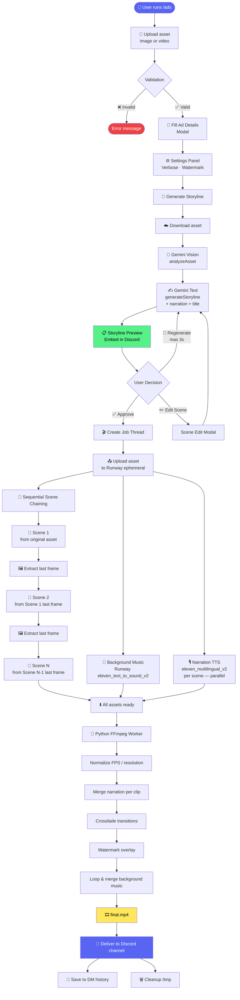
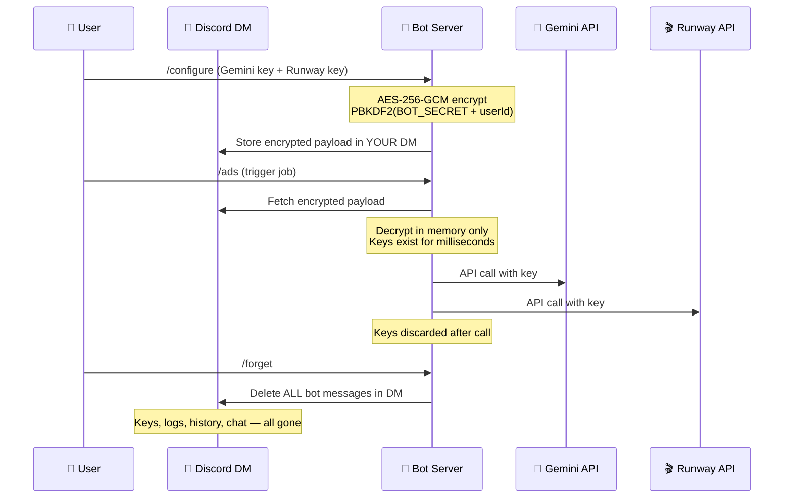
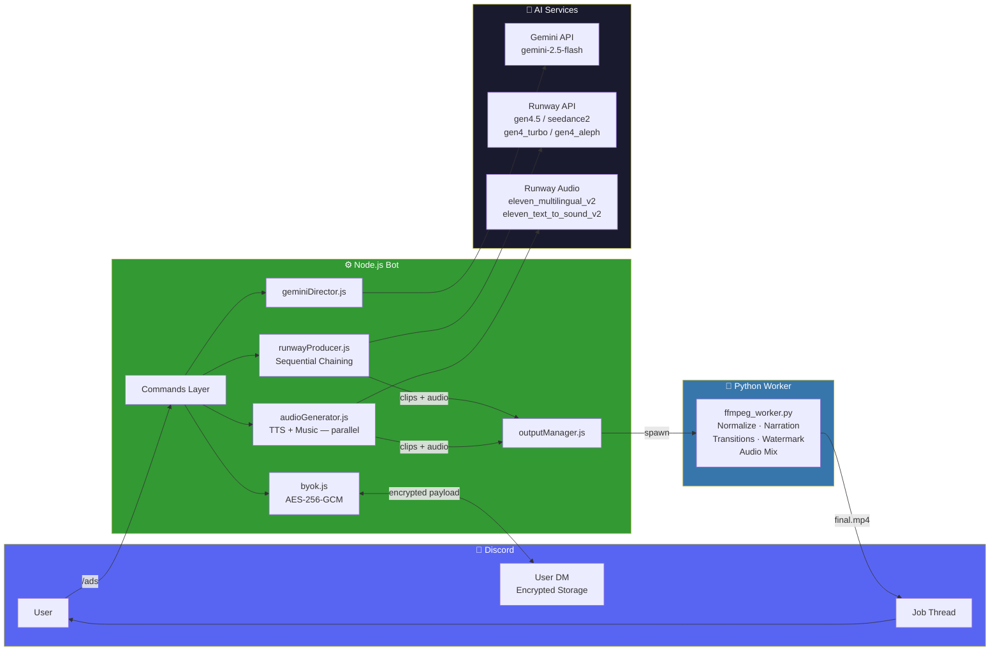

<div align="center">

# 🎬 VOX-Ads Creator

<p align="center">

</p>

**Turn a single product image or video into a professional 30-second ad — entirely inside Discord.**

*Powered by Gemini AI · Runway · FFmpeg*

[](https://nodejs.org)
[](https://python.org)
[](https://discord.js.org)
[](LICENSE)
[](https://runwayml.com)

</div>

---

## ✨ What It Does

VOX-Ads Creator orchestrates a full ad production pipeline directly inside Discord — no external dashboard, no account to create beyond your API keys.

| Step | What Happens |
|------|-------------|
| 1️⃣ | Upload a product image or video with `/ads` |
| 2️⃣ | Gemini AI analyzes your asset and writes a multi-scene storyline with narration |
| 3️⃣ | Preview and edit the storyline before spending any credits |
| 4️⃣ | Runway generates scenes **sequentially** — each scene chains from the last frame of the previous for visual continuity |
| 5️⃣ | Per-scene narration TTS and background music are generated in parallel |
| 6️⃣ | FFmpeg stitches everything with transitions, narration audio, background music, and optional watermark |
| 7️⃣ | Final `.mp4` delivered to your Discord channel |

---

## 🔄 How It Works



---

## 🔐 Privacy & Data Security

> **The server never stores your API keys, personal data, or any credentials.**



**Key guarantees:**
- 🔒 **AES-256-GCM** encryption with PBKDF2 key derivation
- 🗄️ Encrypted payload lives in **your own Discord DM** — no database, no server disk
- ⚡ Plaintext keys exist in memory for **milliseconds** per API call only
- 🚫 Keys are **never logged**, never written to disk
- 🗑️ All temp files (`/tmp/vox_jobs/<job_id>/`) are auto-deleted after delivery
- 🧹 `/forget` wipes **every message the bot ever sent** to your DM — including confirmations, notifications, and all stored data

---

## 🛠️ Commands

| Command | Who | Description |
|---------|-----|-------------|
| `/info` | Everyone | Full guide — commands, presets, tips, FAQ |
| `/ads` | Everyone | Create a video ad from an image or video (max 25MB) |
| `/configure` | Everyone | Save your Gemini + Runway API keys (encrypted, stored in your DM) |
| `/credits` | Everyone | View live Runway credit balance and usage history |
| `/myads` | Everyone | Browse your past video ads with pagination |
| `/forget` | Everyone | Delete all your data **and chat history** from the bot's DM |
| `/setshowcase` | Admin | Set a channel to auto-post featured ads (4+ scenes) |
| `/setratelimit` | Admin | Configure per-user rate limits, whitelist, and blacklist |

---

## 🎨 Style Presets

16 built-in presets. Pass as `Theme,style_key` in the Theme & Style field when running `/ads`.

| Key | Style | Best For |
|-----|-------|----------|
| `auto` | ✨ Auto | Gemini picks the best style automatically |
| `cinematic` | 🎬 Cinematic | Premium products, perfume, cars |
| `thai_comedy` | 😂 Thai Comedy | Viral, absurd, high-energy ads |
| `corporate_premium` | 💼 Corporate Premium | B2B, finance, SaaS |
| `retro_nostalgia` | 🕹️ Retro / Nostalgia | 80s–90s aesthetic, gaming brands |
| `wedding_romantic` | 💍 Wedding / Romantic | Jewelry, perfume, events |
| `ecommerce_product` | 🛍️ E-Commerce | Shopee/Amazon-style product shots |
| `luxury_highend` | 👑 Luxury / High-End | Watches, fashion, premium brands |
| `street_food` | 🍜 Street Food | Local restaurants, UMKM culinary |
| `tech_gadget` | 📱 Tech / Gadget | Smartphones, laptops, gadgets |
| `nature_organic` | 🌿 Nature / Organic | Skincare, health food, eco brands |
| `sport_energy` | 🏋️ Sport / Energy | Sports, supplements, energy drinks |
| `family_heartwarming` | 👶 Family | Insurance, baby products |
| `festival_celebration` | 🎉 Festival | Hari raya, birthdays, events |
| `night_moody` | 🌙 Night / Moody | Nightlife, premium bars, perfume |
| `lifestyle_travel` | 🏖️ Lifestyle / Travel | Resorts, travel brands |

---

## 🎙️ Audio Features

VOX-Ads generates three audio layers automatically:

| Layer | Source | Behavior |
|-------|--------|----------|
| **Narration** | Runway `eleven_multilingual_v2` TTS | Per-scene voiceover, language auto-detected from your input, synced to scene duration |
| **Background Music** | Runway `eleven_text_to_sound_v2` | Single track looped across full video, mood matched to product context |
| **Original clip audio** | From Runway-generated clips | Ducked to 15% under narration (image input) or stripped entirely (video input) |

Narration and background music are generated **in parallel** while scenes are being processed, so they're ready by the time FFmpeg stitching begins.

**Voice presets** (auto-selected by Gemini based on product type — any Runway preset is valid):
- `Eleanor` — neutral, professional. Default fallback
- `Vincent` — authoritative, energetic. Sport, automotive, gaming
- `Serene` — soft, calm. Lifestyle, wellness, beauty

---

## 🔗 Sequential Scene Chaining

For image inputs, each scene is chained from the last frame of the previous scene:

```
Original Asset → Scene 1 → [extract last frame] → Scene 2 → [extract last frame] → Scene 3 → ...
```

This creates **visual continuity** — the camera naturally flows from one scene to the next. If frame extraction fails for any scene, the pipeline falls back to the original asset for the next scene (non-fatal).

For **video inputs** (`seedance2`, `gen4_aleph`), all scenes use the original video as reference — chaining is skipped since these models are designed for video-to-video generation.

---

## 📋 Prerequisites

- **Node.js** 20+
- **Python** 3.11
- **FFmpeg** installed and on `PATH`
- Discord application with bot token → [Discord Developer Portal](https://discord.com/developers/applications)
- Gemini API key → [Google AI Studio](https://aistudio.google.com/)
- Runway API key → [dev.runwayml.com](https://dev.runwayml.com)

---

## 🚀 Setup

### 1. Clone and install

```bash
git clone https://github.com/your-org/vox-ads-creator.git
cd vox-ads-creator

npm install

python3.11 -m venv venv
source venv/bin/activate        # Windows: venv\Scripts\activate
pip install -r requirements.txt
```

### 2. Configure environment

```bash
cp .env.example .env
```

Edit `.env`:

```env
DISCORD_BOT_TOKEN=your_discord_bot_token_here
DISCORD_CLIENT_ID=your_discord_application_id_here

# Generate: node -e "console.log(require('crypto').randomBytes(32).toString('hex'))"
BOT_SECRET=your_32_char_random_secret_here

PYTHON_PATH=/path/to/venv/bin/python3
WORKERS_PATH=/path/to/src/workers
TEMP_DIR=/tmp/vox_jobs

MAX_CONCURRENT_JOBS=3
RATE_LIMIT_PER_HOUR=3
```

### 3. Register slash commands

```bash
node src/deploy-commands.js
```

Run once, or again after any command changes.

### 4. Start the bot

```bash
node src/index.js
```

---

## 🖥️ Production Deployment

### PM2

```bash
npm install -g pm2
pm2 start src/index.js --name vox-ads-bot
pm2 save && pm2 startup

# Useful commands
pm2 status
pm2 logs vox-ads-bot
pm2 restart vox-ads-bot
```

### Railway

This repo includes `railway.json` and `nixpacks.toml` for one-click Railway deployment.

1. Push the repo to GitHub
2. Create a new Railway project and connect the repo
3. Add all variables from `.env.example` in the Railway dashboard
4. Railway builds and starts automatically — Node.js 20, Python 3.11, and FFmpeg are installed via `nixpacks.toml`

---

## 🏗️ Architecture



### Responsibility split

| Layer | Technology | Responsibility |
|-------|-----------|----------------|
| Bot & orchestration | Node.js + discord.js | Discord interactions, BYOK encryption, Gemini calls, Runway calls, workflow |
| Post-production | Python 3.11 + FFmpeg | Normalize, narration merge, transitions, watermark, audio mix |
| Storage | Discord DM messages | Encrypted keys, credit logs, video history — no database |

---

## 🎬 Runway Model Reference

| Model | Input | Use Case | Cost |
|-------|-------|----------|------|
| `gen4.5` | Image | Default, general purpose | 12 cr/sec |
| `gen4_turbo` | Image | Fast, budget-friendly | 5 cr/sec |
| `seedance2` | Image or Video | Long duration, video-to-video | 36 cr/sec |
| `gen4_aleph` | Video | Video style transform/editing | 15 cr/sec |
| `eleven_multilingual_v2` | Text | Per-scene narration TTS | ~1 cr/50 chars |
| `eleven_text_to_sound_v2` | Text | Background music | ~2 cr |

> 💡 Typical 30s ad: `gen4.5` × 5s × 6 scenes = **~360 credits** + ~10 credits for narration + music

---

## 📁 Project Structure

```
src/
├── index.js                  # Bot entry point
├── deploy-commands.js        # Slash command registration (run manually)
├── commands/
│   ├── ads.js                # Main /ads workflow
│   ├── configure.js          # BYOK setup
│   ├── credits.js            # Credit usage + live balance
│   ├── myads.js              # Video gallery
│   ├── info.js               # Help & guide
│   ├── forget.js             # Data + chat history deletion
│   ├── setshowcase.js        # Admin: showcase channel
│   └── setratelimit.js       # Admin: rate limits
├── modules/
│   ├── byok.js               # Key encryption & DM storage
│   ├── geminiDirector.js     # Gemini AI integration
│   ├── runwayProducer.js     # Runway video generation (sequential chaining)
│   ├── audioGenerator.js     # TTS narration + background music (parallel)
│   ├── outputManager.js      # FFmpeg worker orchestration
│   ├── queueManager.js       # Discord thread job tracking
│   ├── discordStorage.js     # Discord DM/thread storage abstraction
│   ├── adminConfig.js        # Rate limit & whitelist/blacklist helpers
│   └── errorHandler.js       # Pipeline error routing & credit estimation
├── workers/
│   └── ffmpeg_worker.py      # Python FFmpeg post-production
├── prompts/
│   └── director_system_prompt.md
└── utils/
    ├── crypto.js             # AES-256-GCM helpers
    ├── validator.js          # JSON schema validation
    └── stylePresets.js       # 16 style configurations
```

---

## 🧪 Running Tests

```bash
npm test
```

Uses [Vitest](https://vitest.dev/) — covers crypto utilities and core validation logic.

---

## 📄 License

MIT License — see [LICENSE](LICENSE) for details.

---

<div align="center">

Built with ❤️ for the **Runway 2026 API Hackathon**

[Gemini AI](https://aistudio.google.com/) · [Runway](https://dev.runwayml.com/) · [discord.js](https://discord.js.org/)

</div>
